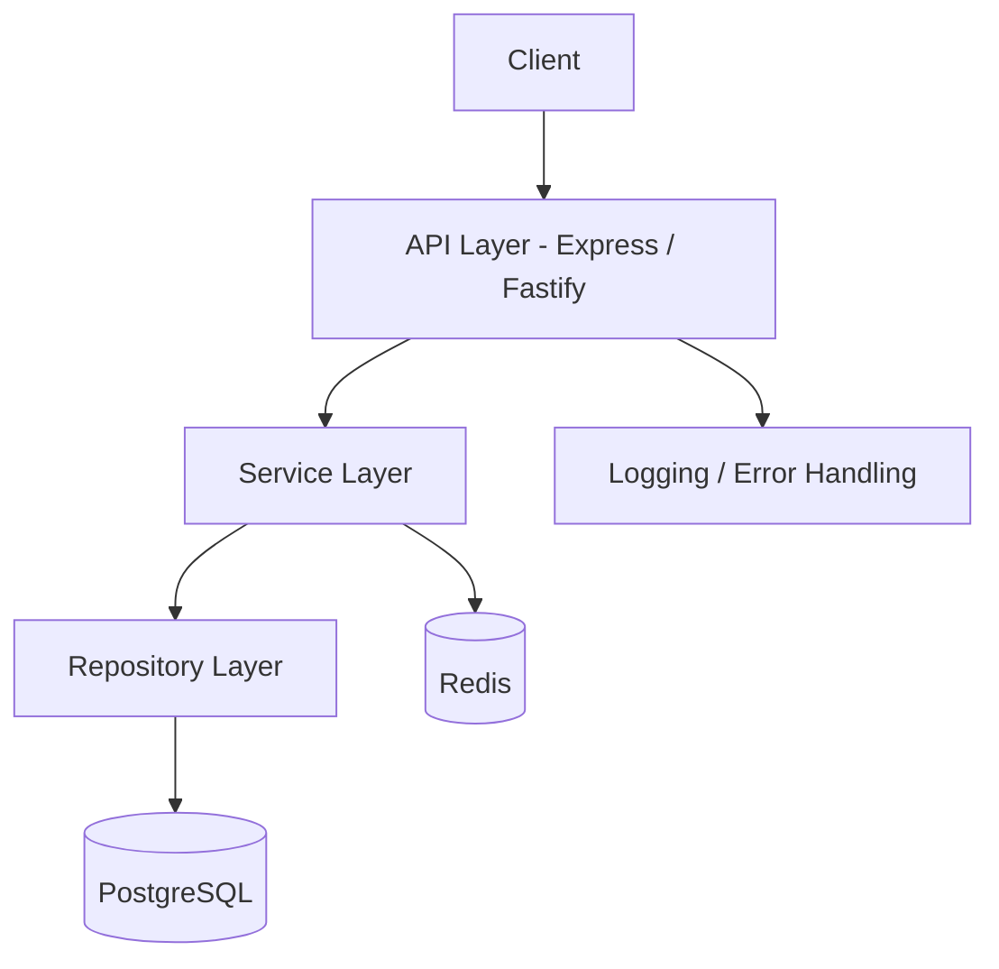
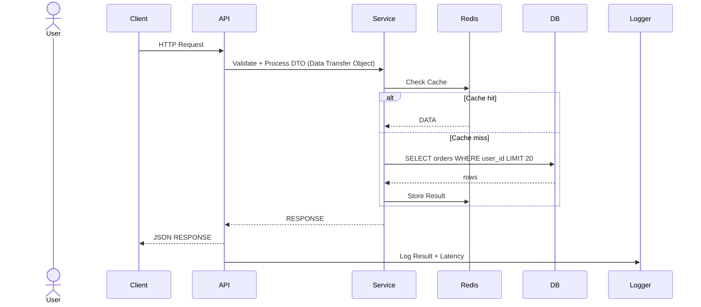

# High-Performance API

Backend API developed for efficient processing of large volumes of data, prioritizing performance, scalability, and architectural organization.

<br/>

> [!NOTE]
> MVP is currently under development.

<br/><br/>


---

## Overview

The High-Performance API is a production-oriented backend application designed to demonstrate scalable API architecture, efficient data access strategies, and modern backend engineering practices.

It focuses on processing large relational datasets while applying caching, optimized querying, request throttling, and centralized error handling to maintain performance under high workloads.

<br/><br/>


---

## Architecture

The application follows a layered architecture that separates business logic, data access, and infrastructure concerns, allowing individual components to evolve independently while maintaining a clean and scalable codebase.

<br/>

### System Diagram:


---

### Request Flow Diagram:


<br/><br/>


---

## Features

### API Architecture:
- RESTful API design
- Layered architecture (Service / Repository)
- API versioning
- DTO validation

### Performance:
- Redis caching
- Cursor-based pagination
- Optimized relational queries
- Efficient request processing

### Reliability:
- Centralized error handling
- Structured application logging
- Request rate limiting
- Consistent API responses

### Infrastructure:
- Dockerized environment
- OpenAPI documentation
- Automated testing
- Environment-based configuration

<br/><br/>


---

## Technology Stack

<div align="center">

| Category | Technologies |
|-----------|--------------|
| Language | JavaScript, TypeScript |
| Runtime | Node.js |
| Framework | Express / Fastify |
| Database | PostgreSQL |
| ORM | Sequelize, Drizzle ORM |
| Cache | Redis |
| Documentation | OpenAPI / Swagger |
| Testing | Jest, Supertest |
| Infrastructure | Docker |

</div>

<br/><br/>


---

## Getting Started

<br/>

> [!NOTE]
> Make sure to configure the `.env` file using the values provided in `.env.example`.

### Prerequisites:
- Node.js
- Docker
- PostgreSQL
- Redis

<br/><br/>


---

## Installation:
```bash
git clone https://github.com/DexxterGWM/high-performance-api.git
cd high-performance-api
npm install
```

<br/><br/>


---

## Repository

[high-performance-api](https://github.com/DexxterGWM/high-performance-api) - Made by: [@DexxterGWM](https://github.com/DexxterGWM)

<br/><br/>


---

## License

This project is intended for educational purposes and portfolio demonstration.

Built to explore high-performance backend architecture, scalable API development, and modern software engineering practices.
